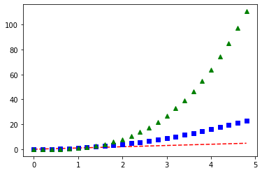

Line Graph


```python
import matplotlib.pyplot as plt
import numpy as np
import pandas as pd
fig=plt.figure()    #1st two lines create box
axes=fig.add_axes([0.1,0.1,0.8,0.8])
x=np.linspace(0,5,10) #linspace(starting val,ending val,how many vals u want to print)
y=x**2
axes.plot(x,y,'r')  #line graph uses plot() , r is red color
axes.set_xlabel('xaxis')
axes.set_ylabel('yaxis')
axes.set_title('Simple line graph')

```


    Text(0.5, 1.0, 'Simple line graph')


```python
x=np.linspace(0,5,10)
x
```


    array([0.        , 0.55555556, 1.11111111, 1.66666667, 2.22222222,
           2.77777778, 3.33333333, 3.88888889, 4.44444444, 5.        ])


```python
#multiline graph
t=np.arange(0.,5.,0.2)
plt.plot(t,t,'r--',t,t**2,'bs',t,t**3,'g^');
```





```python
#legends
fig,ax=plt.subplots()
ax.plot(x,x**2,label="y=x**2")
ax.plot(x,x**3,label="y=x**3")
ax.legend(loc=2)
ax.set_xlabel("xaxis")
ax.set_ylabel("yaxis")
ax.set_title('Graph with legend')

```


    Text(0.5, 1.0, 'Graph with legend')


```python
#one graph with another graph
fig=plt.figure()
axes1=fig.add_axes([0.1,0.1,0.8,0.8])
axes2=fig.add_axes([0.2,0.5,0.4,0.3])
axes1.plot(x,y,'r')
axes1.set_xlabel("xaxis")
axes1.set_ylabel('yaxis')
axes1.set_title('outer graph')
axes2.plot(x,y,'b')
axes2.set_xlabel("xaxis")
axes2.set_ylabel('yaxis')
axes2.set_title('inner graph')
```


    Text(0.5, 1.0, 'inner graph')


```python
#applying different colors and adding parameters
fig,ax=plt.subplots()
ax.plot(x,x+1,color='red',linewidth=6)
ax.plot(x,x+2,color="blue")
ax.plot(x,x+3,color="green")
x
```


    array([0.        , 0.55555556, 1.11111111, 1.66666667, 2.22222222,
           2.77777778, 3.33333333, 3.88888889, 4.44444444, 5.        ])


```python
#loading excel file for linegraph
data=pd.read_excel("Time Series.xlsx",sheet_name=1)
data
```


<div>
<style scoped>
    .dataframe tbody tr th:only-of-type {
        vertical-align: middle;
    }

    .dataframe tbody tr th {
        vertical-align: top;
    }

    .dataframe thead th {
        text-align: right;
    }
</style>
<table border="1" class="dataframe">
  <thead>
    <tr style="text-align: right;">
      <th></th>
      <th>Year</th>
      <th>Time</th>
      <th>Sales</th>
      <th>Gender</th>
    </tr>
  </thead>
  <tbody>
    <tr>
      <th>0</th>
      <td>1999</td>
      <td>0</td>
      <td>20.0</td>
      <td>Male</td>
    </tr>
    <tr>
      <th>1</th>
      <td>2000</td>
      <td>1</td>
      <td>40.0</td>
      <td>Female</td>
    </tr>
    <tr>
      <th>2</th>
      <td>2001</td>
      <td>2</td>
      <td>30.0</td>
      <td>Male</td>
    </tr>
    <tr>
      <th>3</th>
      <td>2002</td>
      <td>3</td>
      <td>NaN</td>
      <td>Male</td>
    </tr>
    <tr>
      <th>4</th>
      <td>2003</td>
      <td>4</td>
      <td>70.0</td>
      <td>NaN</td>
    </tr>
    <tr>
      <th>5</th>
      <td>2004</td>
      <td>5</td>
      <td>65.0</td>
      <td>Male</td>
    </tr>
    <tr>
      <th>6</th>
      <td>2004</td>
      <td>5</td>
      <td>65.0</td>
      <td>Male</td>
    </tr>
  </tbody>
</table>
</div>


```python

data["Sales"].mean()
```


    48.333333333333336


```python
data["Sales"]=data["Sales"].fillna(48.33)
```


```python
data
```


<div>
<style scoped>
    .dataframe tbody tr th:only-of-type {
        vertical-align: middle;
    }

    .dataframe tbody tr th {
        vertical-align: top;
    }

    .dataframe thead th {
        text-align: right;
    }
</style>
<table border="1" class="dataframe">
  <thead>
    <tr style="text-align: right;">
      <th></th>
      <th>Year</th>
      <th>Time</th>
      <th>Sales</th>
      <th>Gender</th>
    </tr>
  </thead>
  <tbody>
    <tr>
      <th>0</th>
      <td>1999</td>
      <td>0</td>
      <td>20.00</td>
      <td>Male</td>
    </tr>
    <tr>
      <th>1</th>
      <td>2000</td>
      <td>1</td>
      <td>40.00</td>
      <td>Female</td>
    </tr>
    <tr>
      <th>2</th>
      <td>2001</td>
      <td>2</td>
      <td>30.00</td>
      <td>Male</td>
    </tr>
    <tr>
      <th>3</th>
      <td>2002</td>
      <td>3</td>
      <td>48.33</td>
      <td>Male</td>
    </tr>
    <tr>
      <th>4</th>
      <td>2003</td>
      <td>4</td>
      <td>70.00</td>
      <td>NaN</td>
    </tr>
    <tr>
      <th>5</th>
      <td>2004</td>
      <td>5</td>
      <td>65.00</td>
      <td>Male</td>
    </tr>
    <tr>
      <th>6</th>
      <td>2004</td>
      <td>5</td>
      <td>65.00</td>
      <td>Male</td>
    </tr>
  </tbody>
</table>
</div>


```python
data["Gender"].mode()
```


    0    Male
    dtype: object


```python
data["Gender"]=data["Gender"].fillna('Female')
```


```python
data
```


<div>
<style scoped>
    .dataframe tbody tr th:only-of-type {
        vertical-align: middle;
    }

    .dataframe tbody tr th {
        vertical-align: top;
    }

    .dataframe thead th {
        text-align: right;
    }
</style>
<table border="1" class="dataframe">
  <thead>
    <tr style="text-align: right;">
      <th></th>
      <th>Year</th>
      <th>Time</th>
      <th>Sales</th>
      <th>Gender</th>
    </tr>
  </thead>
  <tbody>
    <tr>
      <th>0</th>
      <td>1999</td>
      <td>0</td>
      <td>20.00</td>
      <td>Male</td>
    </tr>
    <tr>
      <th>1</th>
      <td>2000</td>
      <td>1</td>
      <td>40.00</td>
      <td>Female</td>
    </tr>
    <tr>
      <th>2</th>
      <td>2001</td>
      <td>2</td>
      <td>30.00</td>
      <td>Male</td>
    </tr>
    <tr>
      <th>3</th>
      <td>2002</td>
      <td>3</td>
      <td>48.33</td>
      <td>Male</td>
    </tr>
    <tr>
      <th>4</th>
      <td>2003</td>
      <td>4</td>
      <td>70.00</td>
      <td>Female</td>
    </tr>
    <tr>
      <th>5</th>
      <td>2004</td>
      <td>5</td>
      <td>65.00</td>
      <td>Male</td>
    </tr>
    <tr>
      <th>6</th>
      <td>2004</td>
      <td>5</td>
      <td>65.00</td>
      <td>Male</td>
    </tr>
  </tbody>
</table>
</div>


```python
data.duplicated()
```


    0    False
    1    False
    2    False
    3    False
    4    False
    5    False
    6     True
    dtype: bool


```python
data2=data.drop_duplicates()
```


```python
data2
```


<div>
<style scoped>
    .dataframe tbody tr th:only-of-type {
        vertical-align: middle;
    }

    .dataframe tbody tr th {
        vertical-align: top;
    }

    .dataframe thead th {
        text-align: right;
    }
</style>
<table border="1" class="dataframe">
  <thead>
    <tr style="text-align: right;">
      <th></th>
      <th>Year</th>
      <th>Time</th>
      <th>Sales</th>
      <th>Gender</th>
    </tr>
  </thead>
  <tbody>
    <tr>
      <th>0</th>
      <td>1999</td>
      <td>0</td>
      <td>20.00</td>
      <td>Male</td>
    </tr>
    <tr>
      <th>1</th>
      <td>2000</td>
      <td>1</td>
      <td>40.00</td>
      <td>Female</td>
    </tr>
    <tr>
      <th>2</th>
      <td>2001</td>
      <td>2</td>
      <td>30.00</td>
      <td>Male</td>
    </tr>
    <tr>
      <th>3</th>
      <td>2002</td>
      <td>3</td>
      <td>48.33</td>
      <td>Male</td>
    </tr>
    <tr>
      <th>4</th>
      <td>2003</td>
      <td>4</td>
      <td>70.00</td>
      <td>Female</td>
    </tr>
    <tr>
      <th>5</th>
      <td>2004</td>
      <td>5</td>
      <td>65.00</td>
      <td>Male</td>
    </tr>
  </tbody>
</table>
</div>


```python
plt.plot(data2.Time,data2.Sales)
```


    [<matplotlib.lines.Line2D at 0x2359acdb160>]


```python

```
